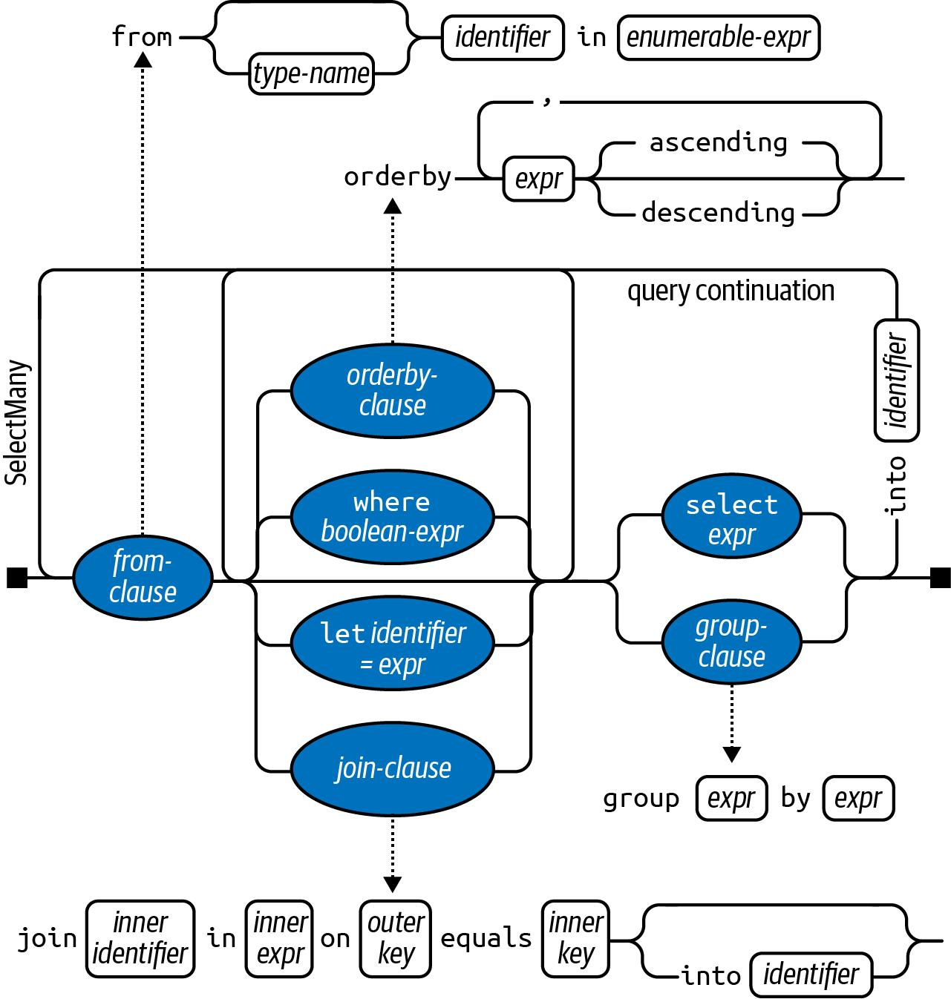

# Introduction to LINQ (Language Integrated Query)

**LINQ** is a powerful set of language and runtime features in C# designed for writing structured, type-safe queries. Whether you are working with local object collections (like Arrays or Lists) or remote data sources (like an SQL database), LINQ provides a unified way to query and transform data.

## Core Concepts: Sequences and Elements

The building blocks of any LINQ query are **sequences** and **elements**:

* **Sequence:** Any object that implements `IEnumerable<T>`. It represents a collection of data.
* **Element:** Each individual item within that sequence.


## What is a Query Operator?

A **query operator** is a method that transforms a sequence. It typically takes an input sequence, performs an operation (like filtering or sorting), and emits a transformed output sequence.

In the `.NET` ecosystem, there are approximately 40 **Standard Query Operators** located in the `System.Linq.Enumerable` class. These are implemented as **static extension methods**.

### Example: The `Where` Operator

The `Where` operator filters a sequence based on a condition (a predicate).

```csharp
string[] names = { "ali", "ahmed", "mostafa","gamal" };

var filteredNames = names.Where(n => n.Length > 3);

// ahmed
// mostafa
// gamal

```

## The Role of Lambda Expressions

Most query operators accept a **lambda expression** as an argument. This expression defines the logic of the operator.

`n => n.Length > 3`: 
when the lambda must return `true`,then the element is included in the output.

## Dual Syntaxes: Fluent vs. Query

LINQ offers two main ways to write queries. Both are compiled into the same underlying code, so the choice often comes down to readability and personal preference.

### 1. Fluent Syntax

```csharp
var query = names.Where(n => n.Contains("a"));

```

### 2. Query Expression Syntax

This can be more readable for queries involving many joins or complex groupings.

```csharp
var query = from n in names
            where n.Contains("a")
            select n;

```

---

## Local vs. Remote Queries

| Query Type | Interface | Description |
| --- | --- | --- |
| **Local Queries** | `IEnumerable<T>` | Often called **LINQ-to-Objects**. Operates on local memory collections. |
| **Remote Queries** | `IQueryable<T>` | Used for remote data sources (e.g., SQL Server). These use "Interpreted Queries" to translate C# logic into database-native languages like SQL. |

---


# Chaining Query Operators

In LINQ, **Chaining** allows you to build complex queries by appending multiple query operators to an expression. This creates a "Fluent Interface," a term popularized by Eric Evans and Martin Fowler, where the output of one operator becomes the input for the next.

## The Fluent Syntax

When you chain operators, data flows from left to right (or top to bottom) through the chain. Each operator performs a specific transformation or filter before passing the sequence along.

```csharp
string[] names = { "Tom", "Dick", "Harry", "Mary", "Jay" };

IEnumerable<string> query = names
    .Where(n => n.Contains("a"))   // Filters names containing 'a'
    .OrderBy(n => n.Length)        // Sorts by length
    .Select(n => n.ToUpper());     // Converts to uppercase

// JAY
// MARY
// HARRY

```

## The "Production Line" Analogy

Think of a LINQ chain as a **production line** of conveyor belts.

* **Station 1 (Where):** Filters out items that don't meet the criteria.
* **Station 2 (OrderBy):** Reorganizes the remaining items.
* **Station 3 (Select):** Transforms each item into a new form.

## Why Extension Methods Matter

Query operators like `Where`, `OrderBy`, and `Select` are implemented as **extension methods** in the `System.Linq.Enumerable` class.

While the compiler eventually translates these into static method calls, using the extension method syntax is what provides the "fluency." Without them, the code would be a hard-to-read nested mess:

**Comparison: Extension vs. Static Syntax**

| Syntax Type | Implementation | Readability |
| --- | --- | --- |
| **Extension (Fluent)** | `names.Where(...).OrderBy(...).Select(...)` | easy to read |
| **Traditional Static** | `Enumerable.Select(Enumerable.OrderBy(Enumerable.Where(names, ...), ...), ...)` |  hard to read |

## Core Characteristics

### 1. Immutability (Functional Paradigm)

A query operator **never alters the input sequence**. Instead, it returns a new sequence. This aligns with functional programming principles, ensuring that your original data source remains intact.

### 2. Lambda Scoping

In the example `.Where(n => n.Contains("a"))`, the variable `n` is privately scoped to that specific lambda expression. using `n` in subsequent parts of the chain doesn't make conflict.

### 3. Type Inference

The compiler is smart enough to infer the types as data moves through the chain:

* **TSource:** The type of the input sequence.
* **TResult:** The type of the output (inferred from the `Select` projection).
* **TKey:** The type of the key used for sorting (inferred from the `OrderBy` expression).

## Natural Ordering

In LINQ-to-Objects, the original ordering of the input sequence is preserved unless an operator specifically changes it (like `OrderBy`)

* **Take(x):** Returns the first *x* elements.
* **Skip(x):** Ignores the first *x* elements and returns the rest.
* **Reverse():** Flips the sequence entirely.


# Query Expressions (Query Syntax)

While **Fluent Syntax** uses method chaining, C# also provides a declarative "syntactic shortcut" known as **Query Expressions**.

## The Basic Structure


A query expression must always:

1. Start with a `from` clause.
2. End with either a `select` or `group` clause.

> Each query-syntax component must be **complete** (starting with `from` and ending with `select` or `group`) before you can chain fluent methods to it.

Here is the same "name filter" query we saw in the Fluent Syntax section, rewritten in Query Syntax:

```csharp
string[] names = { "Tom", "Dick", "Harry", "Mary", "Jay" };

IEnumerable<string> query =
    from n in names              // 1. Source and range variable
    where n.Contains("a")        // 2. Filter
    orderby n.Length             // 3. Sort
    select n.ToUpper();          // 4. Project (Transform)

```

## The Range Variable (`n`)

In the expression `from n in names`, **`n`** is called the **range variable**.

* It represents each individual element in the input sequence.
* It acts much like the iteration variable in a `foreach` loop.
* Its scope is limited to the query expression.

## How the Compiler Sees It

The C# compiler doesn't actually "execute" a query expression; instead, it translates it into **Fluent Syntax** (extension method calls) before compiling.

When you write the query above, the compiler silently rewrites it to:

```csharp
IEnumerable<string> query = names
    .Where(n => n.Contains("a"))
    .OrderBy(n => n.Length)
    .Select(n => n.ToUpper());

```

## Query vs. Fluent: Which one to use?

| Feature | Query Syntax | Fluent Syntax |
| --- | --- | --- |
| **Readability** | High for complex joins/grouping. | High for simple chains. |
| **Capabilities** | Limited to specific keywords. | Can access all 40+ operators. |
| **Structure** | Declarative (looks like SQL). | Method-based (standard C#). |


---
### Flexibility in Translation

Linq is highly flexible. If your data source implements `IQueryable<T>` (like an EF Core database context), the compiler will bind those same keywords to the `Queryable` methods instead of `Enumerable`, allowing the query to be translated into actual SQL for a database.

---


# Range Variables and Syntax Comparisons

In a LINQ query expression, the identifier following the `from` keyword is known as the **Range Variable**. While it looks like a single variable moving through a query, there is more happening under the hood.

## Understanding Range Variables

The range variable (e.g., `n`) represents the current element being processed. Although you use the same name throughout a query, it actually refers to a different sequence at each step.

```csharp
from n in names           // n comes directly from the source array
where n.Contains("a")     // n represents elements passing the filter
orderby n.Length          // n represents filtered elements being sorted
select n.ToUpper()        // n represents sorted elements being projected

```

This is because the compiler translates the query into fluent syntax, where each `n` is actually a **locally scoped parameter** within a separate lambda expression:

```csharp
names.Where (n => n.Contains ("a")) // Scope 1
     .OrderBy (n => n.Length)       // Scope 2
     .Select (n => n.ToUpper())     // Scope 3

```

### Expanding the Range

You can introduce additional range variables using specific clauses:

* `let`: For storing intermediate results.
* `join`: For correlating two different sequences.
* `additional from`: For flattening nested collections (`SelectMany`).


## Choosing Your Syntax

### When Query Syntax is better:

* When using `let` to introduce new variables.
* When performing complex `Joins` or `GroupJoins`.
* When using `SelectMany` (multiple `from` clauses) to flatten collections.

### When Fluent Syntax is better:

* For simple queries (e.g., a single `Where` or `Min`).
* For operators that have **no keyword** in query syntax (e.g., `Count()`, `Take()`, `First()`, `Distinct()`).

---

## Mixed-Syntax Queries

You don't have to choose just one. You can wrap a query expression in parentheses and chain fluent operators onto the end. This is often the most powerful way to write complex queries.

**Example: Counting matches**

```csharp
// Mixing Query Syntax with the .Count() fluent operator
int matches = (from n in names 
               where n.Contains("a") 
               select n).Count();

```

**Example: Finding the first alphabetical match**

```csharp
string first = (from n in names 
                orderby n 
                select n).First();

```

---

# Deferred Execution

An essential feature of LINQ is that most query operators do not execute when they are **constructed**. Instead, they execute when they are **enumerated** (e.g., when a `foreach` loop starts or `MoveNext()` is called) or when using Scalar operator such as `Min()`,`Count()` or Casting operator as `ToList()`,`ToArray()` `etc...`

This is known as **Deferred** or **Lazy Execution**.

### How it Works

Think of a LINQ query as a "recipe". You can define the recipe early, but the cooking doesn't start until you actually sit down to eat.

```csharp
var numbers = new List<int> { 1 };

IEnumerable<int> query = numbers.Select(n => n * 10);

numbers.Add(2); // add an extra element

// The query EXECUTES here during enumeration.
foreach (int n in query)
    Console.Write(n+" "); 

// Output: 10 20 
// Note that '20' is included because the list was evaluated at the last moment!

```

### Immediate Execution

Not all operators are lazy. Some force the query to execute immediately because they return a value that isn't a sequence (scalar) or they need to "freeze" the data into a collection.

* **Scalar Operators:** `Count()`, `First()`, `Average()`, `Max()`.
* **Conversion Operators:** `ToList()`, `ToArray()`, `ToDictionary()`, `ToHashSet()`.

```csharp
// This executes IMMEDIATELY because Count() returns an int.
int count = numbers.Where(n => n <= 2).Count(); 

```


### Reevaluation

Because deferred queries are just recipes, they are **reevaluated** every time you enumerate them. If the underlying data changes between two `foreach` loops, the results will change too.

To prevent this and "cache" your results, use `ToList()` or `ToArray()` at the end of your query.


### The "Captured Variable" Trap

Since lambda expression captures outer variables from its surroundings. It uses the value of those variables **at the time of execution**, not the time of definition.

This often leads to bugs in `for` loops:

### The Bug

```csharp
var actions = new List<Action>();

for (int i = 0; i < 5; i++)
{
    // We add a function to the list
    actions.Add(() => Console.WriteLine(i));
}

// Now we execute them
foreach (var action in actions) 
{
    action(); 
}

//Expected Output: 0, 1, 2, 3, 4
//Actual Output: 5, 5, 5, 5, 5
```


### The Fix

To fix this, you must create a local copy of the variable inside the loop, or use a `foreach` loop (which handles this scope correctly by default).

```csharp
for (int i = 0; i < 5; i++)
{
    int snapshot = i; // A brand new variable for every iteration
    actions.Add(() => Console.WriteLine(snapshot));
}

```


# How Deferred Execution Works: The Decorator Pattern

When you call a LINQ operator like `Where` or `Select`, it doesn't process any data. Instead, it returns a **decorator sequence**.

### Decorator Sequences

Unlike a list or an array, a decorator sequence has no internal storage for elements. Instead, it:

1. **Wraps** the input sequence.
2. **Remembers** the logic (the lambda expression) you provided.
3. **Waits** for someone to ask for data.

When you enumerate the query, the decorator "decorates" the data by applying its logic as it passes from the source to the consumer.


### Chaining Decorators

When you chain multiple LINQ operators, you are essentially stacking decorators .Each operator wraps the one before it.

```csharp
IEnumerable<int> query = new int[] { 5, 12, 3 }
    .Where(n => n < 10)
    .OrderBy(n => n)
    .Select(n => n * 10);

```

In this example:

1. The `Select` decorator wraps the `OrderBy` decorator.
2. The `OrderBy` decorator wraps the `Where` decorator.
3. The `Where` decorator wraps the `int[]` array.

> that's why Linq queries are very efficent with no cost added untill you finaly execute query 


# Subqueries

A **subquery** is a query contained within the lambda expression of another query. Because query operators accept delegates (which can contain any valid C# expression), you can nest one query inside another.

### Basic Subquery Example

In the following example, we sort a list of users by their Email name. To do this, we "split" the string into words and grab the `First()` word

```csharp
string[] users = { "alice@gmail.com", "bob@outlook.com", "charlie@gmail.com" };

// Subquery: s.Split('@').Last() 
var gmailUsers = users.Where(u => u.Split('@').First());

```


### Execution and Scope

* **Outside-In Execution:** A subquery is executed whenever the enclosing lambda expression is evaluated. This means if your outer query has 100 elements, the subquery might run 100 times.
* **Private Scoping:** A subquery can reference variables from the outer query (like `n` in the example above), but the outer query cannot see inside the subquery.
* **Variable Names:** If using Query Syntax, you must use a different range variable name for the subquery (e.g., `n2`) to avoid a naming conflict with the outer variable (`n`).


### The Efficiency Trap

While subqueries are elegant, they can be a performance bottleneck for **local collections** (LINQ-to-Objects).

In the "shortest name" example above, the `Min()` calculation runs for **every single element** in the `names` array. For a local array of 5 names, this isn't a problem. For a list of 100,000 names, it's a disaster.

### Optimization: Factoring Out

To improve efficiency, run the subquery once and store the result in a variable before starting the outer query:


> This optimization is primarily for local queries. If you are using **LINQ-to-SQL** or **EF Core**, the provider usually translates the subquery into a single efficient SQL statement, making the manual factoring unnecessary.


### Subqueries and Deferred Execution

Even if a subquery uses an "immediate execution" operator (like `Count()` or `First()`), the **outer query still remains deferred**.


# Composition Strategies

As queries grow in complexity, writing them as a single, massive expression can become difficult to read and maintain. LINQ provides three main strategies for composing complex queries: **Progressive Construction**, the **`into` keyword**, and **Wrapping**.

## 1. Progressive Query Building

The most straightforward way to manage complexity is to build the query in steps. Since each LINQ operator returns an `IEnumerable<T>`, you can store intermediate steps in variables.

### Benefits:

* **Readability:** Breaks down "walls of code."
* **Conditional Logic:** You can add filters only when needed, which is more efficient than including a "no-op" filter inside the lambda.

```csharp
// 1. Get everyone
var query = users.AsEnumerable();

if(FilterActive == true)
{
// 2. Add a filter 
query = query.Where(u => u.IsActive);
}

// 3. Add another filter
query = query.Where(u => u.Age > 18);

// 4. Look at the result
var result = query.ToList();
```

---

## 2. The `into` Keyword (Query Continuation)

In **Query Syntax**, the order of clauses is strict (it must end with `select` or `group`). The `into` keyword allows you to "restart" a query after a projection, creating a **query continuation**.

```csharp
var query = from p in productPrices
            select p.ToString("C")     // 1. Transform: Convert decimal to "$10.00" string
            into priceString           // 2. Checkpoint: Forget 'p', we only have 'priceString' now
            where priceString.Length > 5 // 3. Filter: Only long price strings (e.g. "$100.00")
            select priceString;

```

### Scoping Rules for `into`

When you use `into`, the previous range variable goes **out of scope**. You can only reference the new Range variable defined by `into` after that .

---

## 3. Wrapping Queries

Wrapping involves putting one query inside the `from` clause of another. While it looks a bit like a subquery, it is actually just another way to achieve sequential chaining.

```csharp
var query = from cleanName in (
                from n in rawInput
                select n.Trim().ToLower() // Inner: Standardize the input
            )
            where cleanName != ""         // Outer: Filter out empty results
            orderby cleanName             // Outer: Sort the clean list
            select cleanName;
```

---

| Strategy | Syntax | Best Used For... |
| --- | --- | --- |
| **Progressive** | Fluent or Query | Adding operators based on `if/else` conditions. |
| **`into`** | Query Syntax | Performing a projection (Select) before a filter (Where). |
| **Wrapping** | Query Syntax | Combining separate query expressions into one statement. |

---

