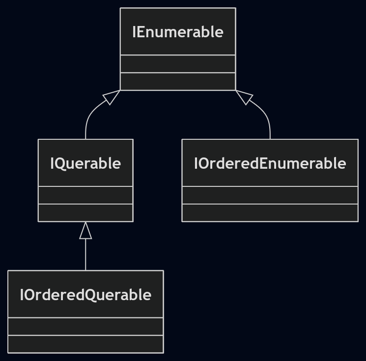

# 🛠 LINQ Ordering

### 1. The Interface Shift

The most critical concept in LINQ ordering is the type transition. While most LINQ operators return `IEnumerable<T>`, ordering operators return a specific subtype:

* **Method:** `OrderBy` / `OrderByDescending`
* **Transition:** `IEnumerable<T>`  `IOrderedEnumerable<T>`
* **Purpose:** This subtype preserves the sorting state, allowing subsequent `ThenBy` calls to **refine** the sort rather than replace it.

### 2. Operator Cheat Sheet

| Operator | Description |
| --- | --- | 
| `Order` |  sort Object itself (Ascending)  | 
| `OrderBy` |  sort by Key (Ascending)   | 
| `OrderByDescending` |  sort by key(Descending) | 
| `ThenBy` | Subsequent refinement (Ascending) | 
| `ThenByDescending` | Subsequent refinement (Descending) | 
| `Reverse` | Flips the sequence order | 

---

#  Implementation Patterns

### Primary vs. Secondary Sorting

* **Refinement:** Use `ThenBy` to sort elements that shared the same key in the previous step.
* **The Chain:** You can chain infinite `ThenBy` calls.
```csharp
// Sort by length, then alphabetically
var query = names.OrderBy(s => s.Length).ThenBy(s => s);

```


### Fluent vs. Query Syntax

Both produce the same IL, but Query syntax is often more readable for multi-level sorts:

```csharp
// Fluent Syntax
var list = db.Purchases.OrderByDescending(p => p.Price).ThenBy(p => p.Name);

// Query Syntax
var list = from p in db.Purchases
           orderby p.Price descending, p.Name
           select p;

```

---

## ⚠️ Critical Notes

### 1. The "Multiple OrderBy" Trap

**Never** chain two `OrderBy` calls unless you intend to completely discard the first one.

* ❌ `names.OrderBy(s => s.Length).OrderBy(s => s)` — The second `OrderBy` wipes out the first.
* ✅ `names.OrderBy(s => s.Length).ThenBy(s => s)` — Correct refinement.

### 2. Typing & Reassignment

> #### Any ordering operator Converts 
* **IEnumerable to IOrderedEnumerable**
* **IQuerable to IOrderedQuerable**




Because `OrderBy` returns `IOrderedEnumerable<T>`, reassigning the variable after a `Where` clause will cause a compilation error if using implicit typing (`var`).

```csharp
// This fails!, because var is IOrderedEnumerable not IEnumerable
var query = names.OrderBy(s => s.Length); 
query = query.Where(n => n.Length > 3); // Compilation error 

```

**Fix:** Use `.AsEnumerable()` after the sort or explicitly type the variable as `IEnumerable<T>`.

### 3. Database Collations (EF Core)

* **Local Queries (In-Memory):** The element (`Order`) or key (`OrderBy`) must implement `IComparable`. You can override this by passing an explicit `IComparer`.
* **Remote Queries (SQL):** `IComparer` is unsupported. Use `.ToUpper()`/`.ToLower()` within the expression or rely on **Database Collation** for case-insensitive sorting.